# DevSaathi AI - System & Architecture Diagrams

This document contains comprehensive architectural, behavioral, and structural diagrams for the **DevSaathi AI** platform. These diagrams are generated using Mermaid.js and can be viewed directly on GitHub or any Markdown viewer that supports Mermaid.

---

## 1. Use Case Diagram

This diagram illustrates the primary interactions between the system actors (Student/Developer, AWS Cognito, Amazon Bedrock AI, and DynamoDB) and the core platform use cases.

```mermaid
graph TD
    %% Actors
    User[["👤 Student / Developer"]]
    Cognito[["🔐 AWS Cognito (Auth)"]]
    Bedrock[["🤖 Amazon Bedrock (AI Engine)"]]
    Dynamo[["📦 AWS DynamoDB (Storage)"]]

    %% Subsystem: Authentication & Settings
    subgraph Auth_Subsystem ["Authentication & Preferences"]
        UC1["Register / Login (SRP)"]
        UC2["Verify Email (OTP)"]
        UC3["Reset Password"]
        UC4["Toggle Multilingual (EN/HI)"]
    end

    %% Subsystem: Core Learning & AI
    subgraph AI_Learning_Subsystem ["AI Tutoring & Practice"]
        UC5["Explore Modular Topics"]
        UC6["Ask AI Explanation & Analogies"]
        UC7["Ask Follow-up Questions"]
        UC8["Generate Custom AI Quiz"]
        UC9["Evaluate Quiz & Feedback"]
        UC10["Generate & Save AI Notes"]
        UC11["AI Code Review & Debugging"]
    end

    %% Subsystem: Analytics & History
    subgraph Analytics_Subsystem ["Progress & Tracking"]
        UC12["View Dashboard Metrics"]
        UC13["Track Mastery Percentage"]
        UC14["View Activity History Feed"]
    end

    %% User Connections
    User --> UC1
    User --> UC2
    User --> UC3
    User --> UC4
    User --> UC5
    User --> UC6
    User --> UC7
    User --> UC8
    User --> UC9
    User --> UC10
    User --> UC11
    User --> UC12
    User --> UC13
    User --> UC14

    %% Backend Service Connections
    UC1 --> Cognito
    UC2 --> Cognito
    UC3 --> Cognito
    UC6 --> Bedrock
    UC7 --> Bedrock
    UC8 --> Bedrock
    UC9 --> Bedrock
    UC10 --> Bedrock
    UC11 --> Bedrock

    UC6 --> Dynamo
    UC9 --> Dynamo
    UC10 --> Dynamo
    UC12 --> Dynamo
    UC13 --> Dynamo
    UC14 --> Dynamo

    %% Styling
    classDef actor fill:#1E293B,stroke:#38BDF8,stroke-width:2px,color:#fff,font-weight:bold;
    classDef usecase fill:#0F172A,stroke:#64748B,stroke-width:1px,color:#E2E8F0;
    class User,Cognito,Bedrock,Dynamo actor;
    class UC1,UC2,UC3,UC4,UC5,UC6,UC7,UC8,UC9,UC10,UC11,UC12,UC13,UC14 usecase;
```



---

## 2. Class & Architecture Diagram

This diagram showcases the structural architecture of the application, detailing the React Frontend components, State Contexts, Custom Hooks, AWS Lambda Handlers, and Database entities.

```mermaid
classDiagram
    %% Frontend Contexts & Hooks
    class LanguageContext {
        +string language
        +setLanguage(lang: string)
        +useLanguage()
    }

    class AuthContext {
        +User user
        +boolean isAuthenticated
        +login(email, pass)
        +verifyOtp(email, code)
        +logout()
    }

    class useAiHooks {
        +useExplainTopic()
        +useGenerateQuiz()
        +useEvaluateQuiz()
        +useCreateNote()
        +useFollowUp()
    }

    %% Frontend Pages
    class LearnPage {
        -string topic
        -string activeModule
        -string followUp
        +handleExplain()
        +handleFollowUp()
        +handleSaveNotes()
        +checkModuleMismatch()
    }

    class DashboardPage {
        -Metrics data
        -ActivityList history
        +fetchDashboardData()
        +renderCharts()
    }

    class QuizPage {
        -Quiz quizData
        -Map answers
        +handleAnswerSelect()
        +handleSubmitQuiz()
    }

    class CodePage {
        -string codeSnippet
        -string language
        +handleAnalyzeCode()
    }

    %% Backend Handlers (AWS Lambda)
    class TutorHandler {
        +explainTopic(body, userId)
        +generateQuiz(body, userId)
        +evaluateQuiz(body, userId)
        +handleFollowUp(body, userId)
        +saveQuizResult(body, userId)
    }

    class CodeHandler {
        +analyzeCode(body, userId)
        +optimizeCode(body, userId)
    }

    class BedrockService {
        +callAI(prompt, maxTokens)
        +parseJSON(text)
        +getPrompt(key, defaultPrompt)
    }

    class DynamoDBService {
        +get(tableName, key)
        +put(tableName, item)
        +query(tableName, index, params)
    }

    %% Relationships
    LearnPage --> useAiHooks : Consumes
    QuizPage --> useAiHooks : Consumes
    CodePage --> useAiHooks : Consumes
    DashboardPage --> AuthContext : Consumes
    LearnPage --> LanguageContext : Consumes

    useAiHooks ..> TutorHandler : HTTP REST Calls
    useAiHooks ..> CodeHandler : HTTP REST Calls

    TutorHandler --> BedrockService : Invokes LLM
    CodeHandler --> BedrockService : Invokes LLM

    TutorHandler --> DynamoDBService : Persists Data
    DashboardPage ..> DynamoDBService : Fetches Metrics
```



---

## 3. Entity-Relationship (ER) Diagram

This diagram describes the database schema design inside AWS DynamoDB. Although DynamoDB is a NoSQL database, this ER diagram represents the logical entity structure, partition keys (`PK`), sort keys (`SK`), and attributes.

```mermaid
erDiagram
    USER ||--o{ ACTIVITY_HISTORY : generates
    USER ||--o{ SAVED_NOTE : owns
    USER ||--o{ QUIZ_RESULT : attempts
    USER ||--o{ LEARNED_TOPIC : masters

    USER {
        string PK PK_userId
        string SK SK_PROFILE
        string email
        string name
        string preferredLanguage
        string createdAt
    }

    LEARNED_TOPIC {
        string PK PK_userId
        string SK SK_TOPIC_topicName
        string topicName
        string moduleName
        string lastReviewedAt
        boolean isMastered
    }

    QUIZ_RESULT {
        string PK PK_userId
        string SK SK_QUIZ_timestamp
        string topicName
        integer totalQuestions
        integer correctAnswers
        integer scorePercentage
        string aiFeedback
        string takenAt
    }

    SAVED_NOTE {
        string PK PK_userId
        string SK SK_NOTE_timestamp
        string title
        string content
        string topicName
        boolean isAI
        string createdAt
    }

    ACTIVITY_HISTORY {
        string PK PK_userId
        string SK SK_ACTIVITY_timestamp
        string activityType "TOPIC_LEARNED | QUIZ_COMPLETED | NOTE_SAVED"
        string title
        string summary
        string route
        string timestamp
    }
```

---

## 4. End-to-End System Architecture Flow

This diagram illustrates the end-to-end data and execution flow when a user requests an AI explanation from the client interface down to the AWS cloud infrastructure.

```mermaid
graph LR
    %% Client Layer
    subgraph Client_Layer ["Client Tier"]
        UI["💻 React Frontend (Vite)"]
        State["🔄 TanStack Query & Context"]
    end

    %% API Gateway Layer
    subgraph API_Layer ["API Tier"]
        GW["🌐 AWS API Gateway / REST"]
    end

    %% Compute Layer
    subgraph Compute_Layer ["Serverless Compute Tier"]
        Lambda["⚡ AWS Lambda (Node.js/TS)"]
        PromptEngine["📝 Prompt Engine (Bedrock Lib)"]
    end

    %% AI & Data Layer
    subgraph Cloud_Services ["AWS Cloud & AI Services"]
        S3["🪣 AWS S3 (Prompt Templates)"]
        BedrockNova["🧠 Amazon Bedrock (Nova Lite LLM)"]
        DynamoDB["📦 AWS DynamoDB (Single-Table)"]
    end

    %% Flow Connections
    UI -->|1. User asks Topic| State
    State -->|2. POST /explain| GW
    GW -->|3. Route Request| Lambda
    Lambda -->|4. Get Template| PromptEngine
    PromptEngine -->|5. Fetch S3 Prompt| S3
    PromptEngine -->|6. Inject Context (Lang/Module)| BedrockNova
    BedrockNova -->|7. Return JSON Explanation| Lambda
    Lambda -->|8. Save Learned Topic| DynamoDB
    Lambda -->|9. Return Formatted Response| UI

    %% Styling
    classDef client fill:#0284C7,stroke:#0369A1,stroke-width:2px,color:#fff,font-weight:bold;
    classDef api fill:#D97706,stroke:#B45309,stroke-width:2px,color:#fff,font-weight:bold;
    classDef compute fill:#10B981,stroke:#047857,stroke-width:2px,color:#fff,font-weight:bold;
    classDef cloud fill:#6366F1,stroke:#4338CA,stroke-width:2px,color:#fff,font-weight:bold;

    class UI,State client;
    class GW api;
    class Lambda,PromptEngine compute;
    class S3,BedrockNova,DynamoDB cloud;
```
