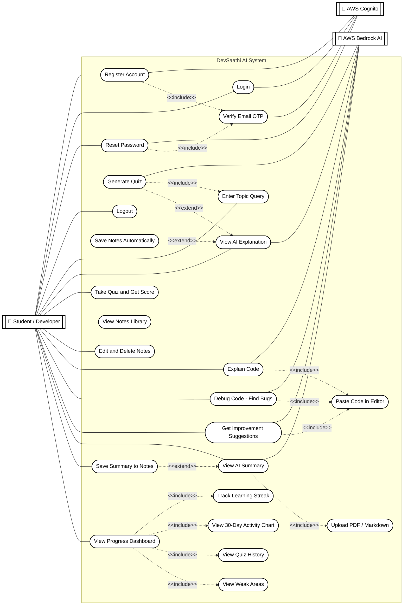
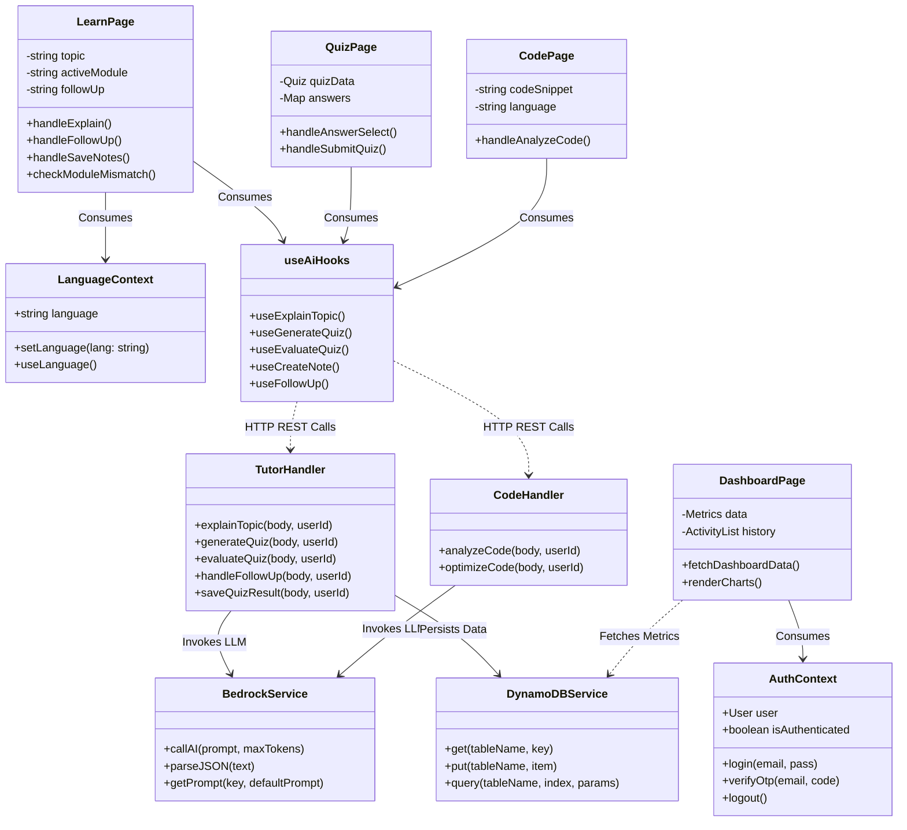

# DevSaathi AI - System & Architecture Diagrams

This document contains comprehensive architectural, behavioral, and structural diagrams for the **DevSaathi AI** platform. These diagrams are generated using Mermaid.js and can be viewed directly on GitHub or any Markdown viewer that supports Mermaid.

---

### 1. Use Case Diagram

This diagram illustrates the primary interactions between the system actors (Student/Developer, AWS Cognito, Amazon Bedrock AI, and DynamoDB) and the core platform use cases. It is styled in a clean, plain monochrome look with actors distributed on the left and right sides.



---

## 2. Class & Architecture Diagram

This diagram showcases the structural architecture of the application, detailing the React Frontend components, State Contexts, Custom Hooks, AWS Lambda Handlers, and Database entities.



---

## 3. Entity-Relationship (ER) Diagram

This diagram describes the database schema design inside AWS DynamoDB. Although DynamoDB is a NoSQL database, this ER diagram represents the logical entity structure, partition keys (`PK`), sort keys (`SK`), and attributes.

```mermaid
erDiagram
    USER ||--o{ ACTIVITY_HISTORY : generates
    USER ||--o{ SAVED_NOTE : owns
    USER ||--o{ QUIZ_RESULT : attempts
    USER ||--o{ LEARNED_TOPIC : masters

    USER {
        string PK PK_userId
        string SK SK_PROFILE
        string email
        string name
        string preferredLanguage
        string createdAt
    }

    LEARNED_TOPIC {
        string PK PK_userId
        string SK SK_TOPIC_topicName
        string topicName
        string moduleName
        string lastReviewedAt
        boolean isMastered
    }

    QUIZ_RESULT {
        string PK PK_userId
        string SK SK_QUIZ_timestamp
        string topicName
        integer totalQuestions
        integer correctAnswers
        integer scorePercentage
        string aiFeedback
        string takenAt
    }

    SAVED_NOTE {
        string PK PK_userId
        string SK SK_NOTE_timestamp
        string title
        string content
        string topicName
        boolean isAI
        string createdAt
    }

    ACTIVITY_HISTORY {
        string PK PK_userId
        string SK SK_ACTIVITY_timestamp
        string activityType "TOPIC_LEARNED | QUIZ_COMPLETED | NOTE_SAVED"
        string title
        string summary
        string route
        string timestamp
    }
```

---

## 4. End-to-End System Architecture Flow

This diagram illustrates the end-to-end data and execution flow when a user requests an AI explanation from the client interface down to the AWS cloud infrastructure. It is styled in a clean monochrome (black & white) look.

```mermaid
graph LR
    %% Client Layer
    subgraph Client_Layer ["Client Tier"]
        UI["💻 React Frontend (Vite)"]
        State["🔄 TanStack Query & Context"]
    end

    %% API Gateway Layer
    subgraph API_Layer ["API Tier"]
        GW["🌐 AWS API Gateway / REST"]
    end

    %% Compute Layer
    subgraph Compute_Layer ["Serverless Compute Tier"]
        Lambda["⚡ AWS Lambda (Node.js/TS)"]
        PromptEngine["📝 Prompt Engine (Bedrock Lib)"]
    end

    %% AI & Data Layer
    subgraph Cloud_Services ["AWS Cloud & AI Services"]
        S3["🪣 AWS S3 (Prompt Templates)"]
        BedrockNova["🧠 Amazon Bedrock (Nova Lite LLM)"]
        DynamoDB["📦 AWS DynamoDB (Single-Table)"]
    end

    %% Flow Connections
    UI -->|1. User asks Topic| State
    State -->|2. POST /explain| GW
    GW -->|3. Route Request| Lambda
    Lambda -->|4. Get Template| PromptEngine
    PromptEngine -->|5. Fetch S3 Prompt| S3
    PromptEngine -->|6. Inject Context (Lang/Module)| BedrockNova
    BedrockNova -->|7. Return JSON Explanation| Lambda
    Lambda -->|8. Save Learned Topic| DynamoDB
    Lambda -->|9. Return Formatted Response| UI

    %% Styling (Clean Plain Monochrome)
    style Client_Layer fill:#ffffff,stroke:#000000,stroke-width:1.5px,stroke-dasharray: 5 5;
    style API_Layer fill:#ffffff,stroke:#000000,stroke-width:1.5px,stroke-dasharray: 5 5;
    style Compute_Layer fill:#ffffff,stroke:#000000,stroke-width:1.5px,stroke-dasharray: 5 5;
    style Cloud_Services fill:#ffffff,stroke:#000000,stroke-width:1.5px,stroke-dasharray: 5 5;

    classDef plain fill:#ffffff,stroke:#000000,stroke-width:1.5px,color:#000000;
    class UI,State,GW,Lambda,PromptEngine,S3,BedrockNova,DynamoDB plain;
```

---

## 5. System Architecture Diagram

This diagram displays the high-level system architecture of the DevSaathi AI platform, detailing the primary components, data flow routing, and storage tier in a clean monochrome block style.

```mermaid
graph TD
    %% Actors / Components
    Cognito["🔐 AWS Cognito<br/>(Authentication)"]
    Student["👤 Student / Developer"]
    
    ViteApp["💻 React Frontend (Vite)<br/>(Client Application)"]

    ApiGateway["🌐 AWS API Gateway<br/>(API Routing)"]
    Lambda["⚡ AWS Lambda Functions<br/>(Tutor, Code, Docs, Dash)"]

    %% Bottom Tier: Datastores & AI Engines
    S3Prompts[("🪣 AWS S3 Bucket<br/>(Prompt Templates)")]
    Bedrock["🧠 Amazon Bedrock<br/>(Nova Lite AI Model)"]
    S3Uploads[("🪣 AWS S3 Bucket<br/>(User File Uploads)")]
    DynamoDB[("📦 AWS DynamoDB<br/>(Single-Table Storage)")]

    %% Connections
    Student -->|1. Authenticate / Login| ViteApp
    ViteApp <-->|2. Validate Session / JWT Token| Cognito
    
    Student -->|3. Learn, Code, & Upload Docs| ViteApp
    ViteApp -->|4. REST API Calls (HTTPS)| ApiGateway
    
    ApiGateway -->|5. Trigger Handlers| Lambda
    
    Lambda -->|6. Fetch Prompt Templates| S3Prompts
    Lambda -->|7. Request AI Response| Bedrock
    Lambda -->|8. Read / Write User Files| S3Uploads
    Lambda -->|9. Save Progress, Notes, Streaks| DynamoDB

    %% Styling (Plain Monochrome)
    classDef plain fill:#ffffff,stroke:#000000,stroke-width:1.5px,color:#000000;
    class Student,Cognito,ViteApp,ApiGateway,Lambda,S3Prompts,Bedrock,S3Uploads,DynamoDB plain;
```

---

## 6. Data Flow Diagrams (DFD)

This section contains the Data Flow Diagrams (DFD) for the DevSaathi AI platform, styled in a clean Yourdon-Coad notation style with process circles (blue), datastore databases/cylinders (yellow), and entity rectangles (gray).

### 6.1 Level 0 — Context Diagram
The Context Diagram defines the system boundary, showing the single central process (`DevSaathi AI System`) and its interactions with external entities.

```mermaid
graph LR
    %% External Entities (Gray Rectangles)
    Student["👤 Student / Developer"]
    Cognito["🔐 AWS Cognito"]
    Bedrock["🤖 AWS Bedrock AI"]
    S3["📦 AWS S3"]

    %% System Process (Blue Circle - Yourdon-Coad style)
    System((DevSaathi AI System))

    %% Data Flows
    Student -->|Topic queries, Code, Files,<br/>Quiz answers, Login credentials| System
    System -->|Explanations, Quiz questions,<br/>Debug results, Summaries, Progress data| Student

    System -->|Registration data, Login credentials| Cognito
    Cognito -->|JWT tokens, OTP codes,<br/>User verification status| System

    System -->|Formatted prompts with user input| Bedrock
    Bedrock -->|JSON AI responses<br/>(explanations, bugs, summaries)| System

    System -->|User uploaded files,<br/>React app bundle, Prompt templates| S3
    S3 -->|Pre-signed URLs, File contents, Prompt text| System

    %% Yourdon-Coad Color Styling
    classDef entity fill:#f1f5f9,stroke:#475569,stroke-width:2px,color:#0f172a,font-weight:bold;
    classDef process fill:#dbeafe,stroke:#1d4ed8,stroke-width:2px,color:#1e3a8a,font-weight:bold;
    
    class Student,Cognito,Bedrock,S3 entity;
    class System process;
```

### 6.2 Level 1 — Detailed Data Flow Diagram
The Level 1 DFD decomposes the central system process into 6 detailed subprocesses and exposes the primary data stores (DynamoDB Tables and S3 Buckets) to illustrate data persistence and movement.

```mermaid
graph LR
    %% External Entities (Gray Rectangles)
    User["👤 Student / Developer"]
    Cognito["🔐 AWS Cognito"]
    Bedrock["🤖 AWS Bedrock AI"]

    %% Processes (Blue Circles - Yourdon-Coad style)
    P1((P1: Authentication Process))
    P2((P2: AI Learning Tutor Process))
    P3((P3: Code Analyzer Process))
    P4((P4: Documentation Process))
    P5((P5: Dashboard & Progress Process))
    P6((P6: Notes Management Process))

    %% Data Stores (Yellow Databases)
    DS1[("DS1: Users Table<br/>PK: USER#id, SK: PROFILE")]
    DS2[("DS2: Topics Table<br/>PK: USER#id, SK: TOPIC#timestamp")]
    DS3[("DS3: Quiz Table<br/>PK: USER#id, SK: QUIZ#timestamp")]
    DS4[("DS4: Notes Table<br/>PK: USER#id, SK: NOTE#timestamp")]
    DS5[("DS5: Docs Table<br/>PK: USER#id, SK: DOC#timestamp")]
    DS6[("DS6: S3 - User Uploads Bucket")]
    DS7[("DS7: S3 - Prompt Templates Bucket")]

    %% Flows for P1 (Authentication)
    User -->|email, password, name| P1
    P1 -->|registration / login request| Cognito
    Cognito -->|JWT token / OTP| P1
    P1 -->|write user profile| DS1
    P1 -->|auth token, session| User

    %% Flows for P2 (AI Learning Tutor & Quizzes)
    User -->|topic text, language preference| P2
    P2 -->|fetch prompt template| DS7
    DS7 -->|explain-topic.txt| P2
    P2 -->|formatted prompt| Bedrock
    Bedrock -->|explanation JSON| P2
    P2 -->|write topic record| DS2
    P2 -->|write quiz results and score| DS3
    P2 -->|explanation, example, subtopics, quiz questions| User

    %% Flows for P3 (Code Analyzer)
    User -->|code snippet, action type| P3
    P3 -->|fetch code prompt template| DS7
    DS7 -->|debug/explain/improve template| P3
    P3 -->|formatted code prompt| Bedrock
    Bedrock -->|analysis JSON (bugs/explanation)| P3
    P3 -->|code analysis results| User

    %% Flows for P4 (Documentation)
    User -->|PDF / Markdown file| P4
    P4 -->|upload file via pre-signed URL| DS6
    DS6 -->|file content for processing| P4
    P4 -->|extracted text + summarize prompt| Bedrock
    Bedrock -->|summary JSON| P4
    P4 -->|write doc summary record| DS5
    P4 -->|structured summary with key points| User

    %% Flows for P6 (Notes Management)
    P2 -->|topic explanation for note generation| P6
    P4 -->|doc summary for note generation| P6
    User -->|manual note content| P6
    P6 -->|structure notes prompt| Bedrock
    Bedrock -->|formatted note content| P6
    P6 -->|write / update note| DS4
    P6 -->|saved note confirmation| User

    %% Flows for P5 (Dashboard & Progress)
    User -->|dashboard view request| P5
    P5 -->|query topics count| DS2
    P5 -->|query quiz results and scores| DS3
    P5 -->|query notes count| DS4
    P5 -->|query docs count| DS5
    P5 -->|stats, 30-day chart data, weak areas| User

    %% Yourdon-Coad Color Styling
    classDef entity fill:#f1f5f9,stroke:#475569,stroke-width:2px,color:#0f172a,font-weight:bold;
    classDef process fill:#dbeafe,stroke:#1d4ed8,stroke-width:2px,color:#1e3a8a,font-weight:bold;
    classDef datastore fill:#fef08a,stroke:#ca8a04,stroke-width:2px,color:#713f12,font-weight:bold;
    
    class User,Cognito,Bedrock entity;
    class P1,P2,P3,P4,P5,P6 process;
    class DS1,DS2,DS3,DS4,DS5,DS6,DS7 datastore;
```
